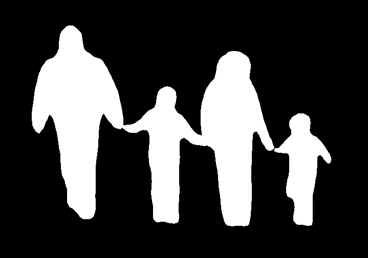

# Pedestrian-Segmentation-using-Detectron2
Pedestrian Segmentation using Detectron2  + Segment annotation masks from the background

* Example Output of Detectron2    

* Example Output After Segmenting The objects from the background   

